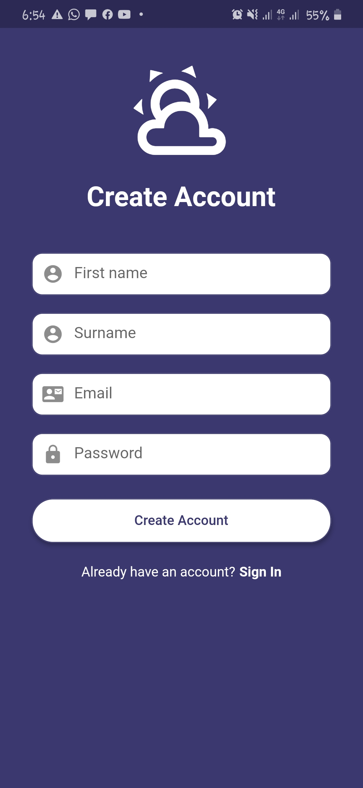
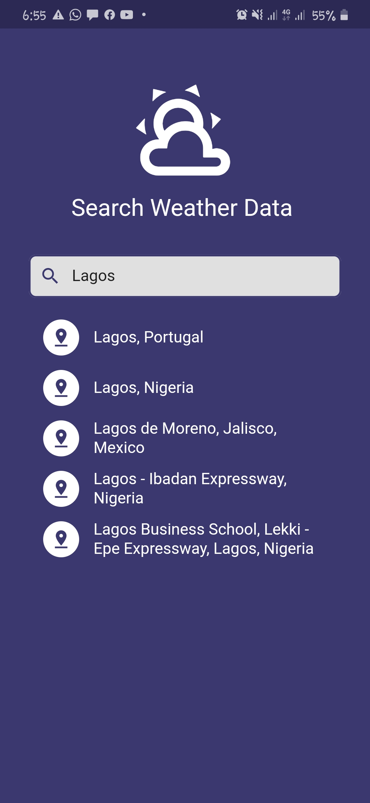
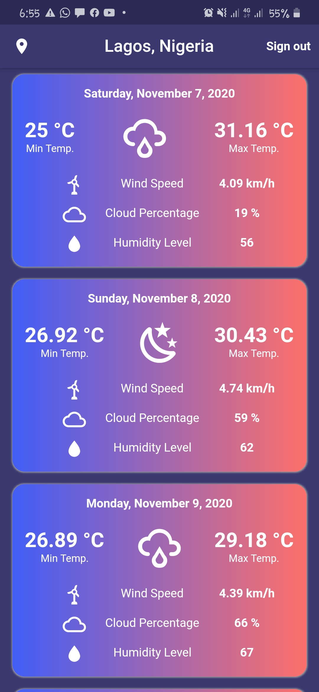
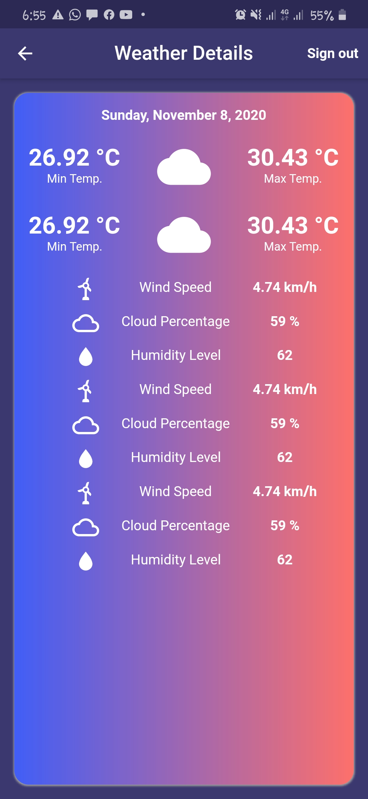

# Flutter Weather App

A Flutter app to to display Weather Forecasts 

The [OpenWeather API](https://openweathermap.org/) was used to fetch the weather data. 

 

## ✨ Features
* Firebase Authentication.
* Google Places (Autocomplete search features for places).
* Provider.
* MVVM Architecture.
* SharedPreference (Persistence of location and user login state)

 

## 📸 Screenshots
| Splash Screen| Sign In Screen| Sign Up Screen|
|------|-------|-------|
||||
| Select Location Screen| Weather Screen| Weather DetailsScreen|
||||
